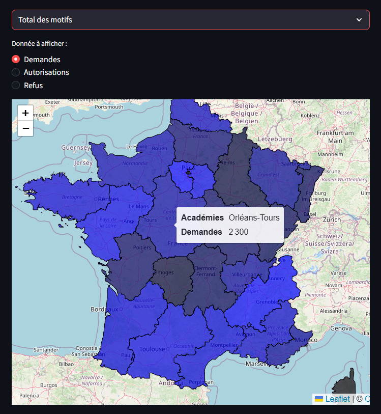
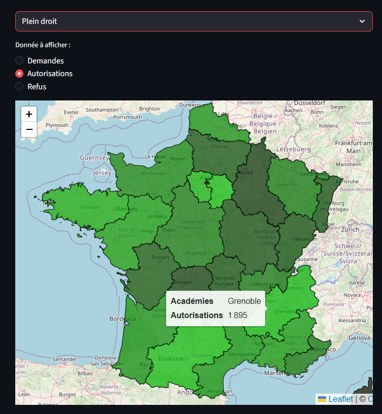
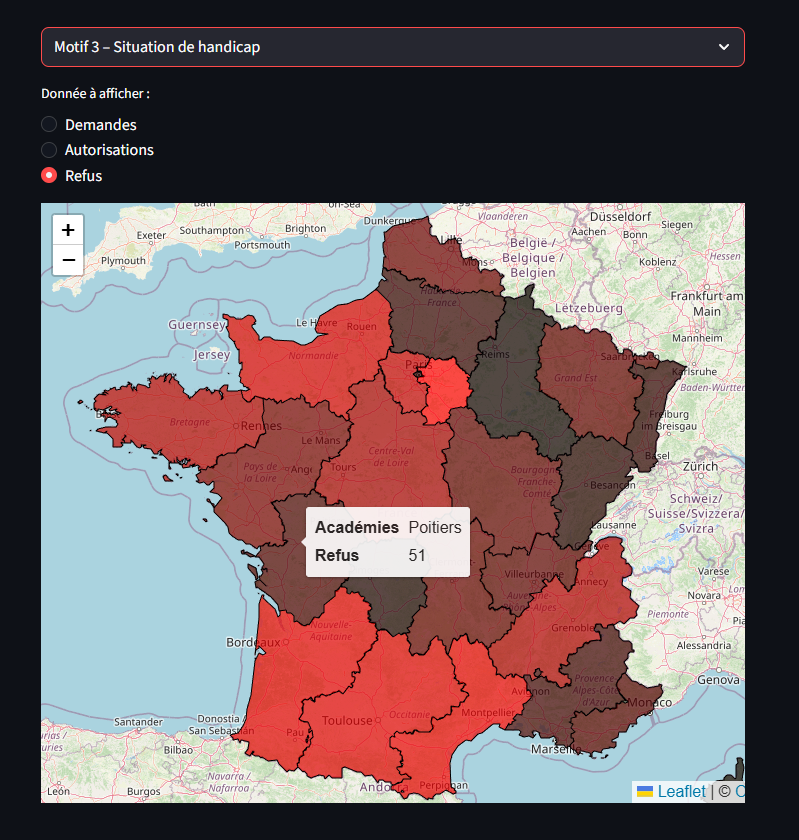

# Carte Interactive IEF par Académie – Années 2023-2024

**Visualisation géographique des demandes, autorisations et refus d'Instruction En Famille (IEF) en France métropolitaine.**

Projet personnel réalisé pour démontrer des compétences en **data visualisation interactive**, **géospatial** et **développement d'applications data** avec Python.

## Contexte du projet

Depuis la réforme de 2021 (loi "confortant le respect des principes de la République"), l'**Instruction En Famille (IEF)** nécessite une autorisation préalable délivrée par les académies selon 4 motifs principaux + un régime de plein droit (transitoire jusqu'en 2023-2024).

Ce dashboard permet d'explorer :

- Le **volume** de demandes, autorisations et refus
- Par **motif** (Situation propre à l’enfant, Projet éducatif, Handicap, Autre situation, Plein Droit)
- Par **académie**

Objectif : rendre visibles les disparités territoriales et l'impact de la réforme sur l'accès à l'IEF.

**Source des données** : Données agrégées par académie issues de réponses ministérielles (Sénat/Assemblée nationale), rapports Cour des comptes et publications publiques (2023-2024). Géométries des académies fusionnées dans un fichier GeoJSON personnalisé.

## Aperçu

### Vue des Demandes



### Vue des Autorisations



### Vue des Refus



## Fonctionnalités principales

- **Carte choroplèthe interactive** (Folium + GeoPandas) centrée sur la France
- Choix du **motif** via menu déroulant
- Choix de la **variable** à afficher : Demandes / Autorisations / Refus
- Coloration dynamique :
  - Bleu → Demandes (intensité proportionnelle)
  - Vert → Autorisations
  - Rouge → Refus
- **Tooltip** au survol : nom de l'académie + valeur sélectionnée
- Optimisé pour visualisation desktop (Streamlit)

## Technologies utilisées

- **Python** 3.x
- **Streamlit** → interface web interactive
- **Folium** + **streamlit-folium** → cartes Leaflet intégrées
- **GeoPandas** → lecture et manipulation GeoJSON
- **Caching** (@st.cache_data) pour performances
- Fonctions personnalisées pour **coloration dynamique** (RGB intensité) et tooltips

## Installation et lancement local

1. Cloner le dépôt :
   ```bash
   git clone https://github.com/Heneault-IA/[nom-du-repo].git
   cd [nom-du-repo]
   ```

Installer les dépendances :Bashpip install -r requirements.txt
Lancer l'application :Bashstreamlit run app.py

Fichier principal : app.py (contient le code fourni).
Prérequis : Le fichier DataAcadémies.geojson doit être présent dans le dossier du projet (ou au même niveau).

Exemple de tooltip :

Académie : Bordeaux
Motif Projet éducatif – Refus : 120

Améliorations futures possibles

- Ajout des DOM-TOM (géométries séparées)
- Filtre par année scolaire supplémentaire
- Intégration de tendances temporelles (2022 → 2025)
- Export PDF/PNG des cartes
- Version Tableau / Power BI pour comparaison

Lien avec mon profil Data Analyst, ce projet illustre ma capacité à :

- Transformer des données brutes (statistiques + géo) en insights visuels impactants
- Créer des applications data interactives et user-friendly
- Gérer des données géospatiales (GeoJSON, choroplèthes)
- Optimiser les performances (caching)

Auteur

Thomas Heneault

Data Analyst | Python, SQL, Power BI, Géovisualisation

GitHub: https://github.com/Heneault-IA/

LinkedIn: https://www.linkedin.com/in/thomas-heneault-b955b2173/

Mail: heneault.t@outlook.com

N'hésite pas à forker ou à me contacter pour suggestions/améliorations !

⭐ Si ce projet t'intéresse, mets une étoile !
